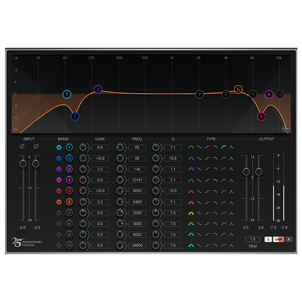

# G3X Equalizer

G3X Equalizer é o nome de trabalho de um equalizador paramétrico de dez bandas para
correção cirúrgica e modelagem tonal, em fase de planejamento. A primeira
entrega será um VST3 64-bit para Windows, desenvolvido em C++20 com JUCE e
CMake, seguindo o processo dos plugins G3X.

## Estado

**M2 — cadeia de dez bandas e produto estéreo implementados.**

- [PRD](PRD.md)
- [Referência visual e fontes](docs/references/README.md)
- [Captura da interface de referência](docs/references/waves-q10-equalizer-interface.png)



## Limites da referência

O Waves Q10 foi estudado somente para entender a categoria de equalizadores
paramétricos multibanda e o fluxo combinado de edição gráfica e numérica. O
G3X Equalizer terá DSP, marca, código, interface, textos, componentes gráficos e
presets próprios.

Nenhum ativo da Waves será incorporado ao produto final.

## Licença

Distribuído sob a [licença MIT](LICENSE).

## Implementação atual

- Engine biquad C++20 independente de framework e com processamento em `double`.
- Bell, Adaptive Bell, Low Shelf, High Shelf, High Pass e Low Pass.
- Faixas sanitizadas de 10 Hz a `min(30 kHz, 0,475 × sample rate)`, ±24 dB e
  Q de 0,10 a 100.
- Ganho zero exatamente neutro para bells e shelves.
- Consulta da resposta complexa e verificação dos polos de cada filtro.
- Proteção contra parâmetros, entrada e estado numérico inválidos.
- Testes analíticos e de processamento entre 44,1 e 192 kHz.
- Cadeia fixa de dez bandas com slots inativos exatamente neutros.
- Estéreo vinculado e estados independentes L/R para operação dual-mono.
- Smoothing de 20 ms para frequência, ganho, Q, enable e ganhos globais.
- Crossfade de topologia em mudanças de tipo e bypass geral sem clique.
- Processamento de hosts em `float` e `double`, com zero latência adicionada.
- Wrapper JUCE VST3/Standalone com IDs estáveis e estado versionado.

## Build

```bash
cmake -S . -B build
cmake --build build --config Release
ctest --test-dir build --build-config Release --output-on-failure
```

Os testes DSP também podem ser executados sem dependências externas:

```bash
g++ -std=c++20 -Wall -Wextra -Wpedantic -Werror -Isrc \
  src/dsp/BiquadFilter.cpp src/dsp/Q10Processor.cpp \
  tests/BiquadFilterTests.cpp tests/Q10ProcessorTests.cpp -o g3x-q10-tests
./g3x-q10-tests
```

## Download e instalação — Windows x64

1. Abra [Actions](https://github.com/6uilhermeTeixeira/plugin-g3x-equalizer/actions) e selecione uma execução bem-sucedida da branch `main`.
2. Em **Artifacts**, baixe `G3X-Equalizer-Windows-x64-<commit>`. O download fica disponível por 30 dias; **Run workflow** permite gerar um novo build.
3. Extraia o ZIP. A raiz contém somente `SHA256SUMS.txt` e a pasta `G3X Equalizer.vst3`, com todos os arquivos internos do plugin.
4. Na pasta extraída, abra o PowerShell e verifique o binário:

```powershell
$expected, $relativePath = (Get-Content -LiteralPath .\SHA256SUMS.txt -Raw).Trim() -split '  ', 2
$actual = (Get-FileHash -LiteralPath $relativePath -Algorithm SHA256).Hash.ToLowerInvariant()
if ($actual -ne $expected) { throw "SHA-256 divergente; baixe o artifact novamente." }
"SHA-256 confirmado."
```

5. Copie a pasta **`G3X Equalizer.vst3` inteira** para `C:\Program Files\Common Files\VST3` e atualize a busca de plugins da DAW. A cópia pode solicitar permissão de administrador.

O SHA-256 verifica o binário Windows x64 dentro do bundle; não é o hash do ZIP ou dos recursos. O artifact contém o VST3 Release; o aplicativo Standalone continua disponível como alvo de compilação, mas não é incluído no download.
